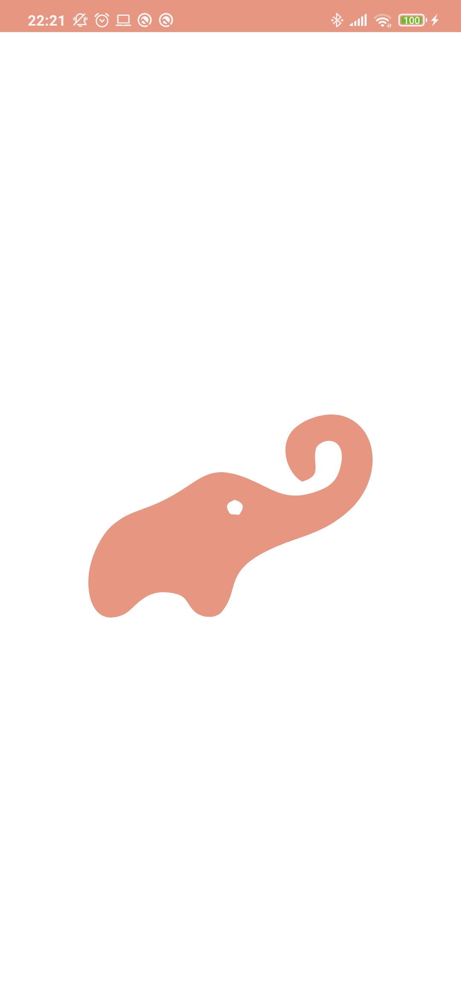
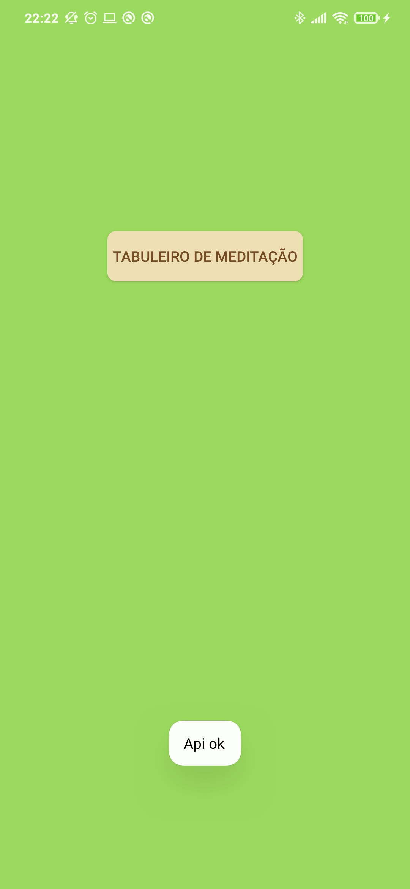
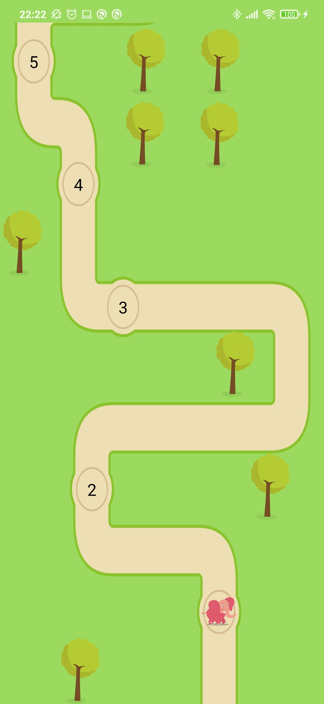
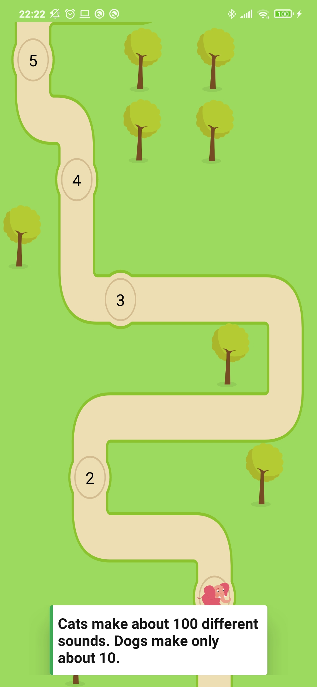
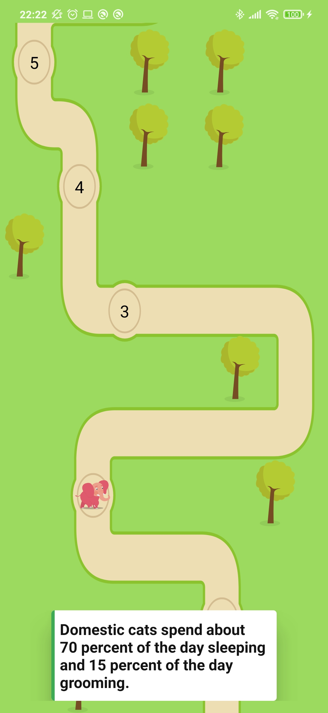
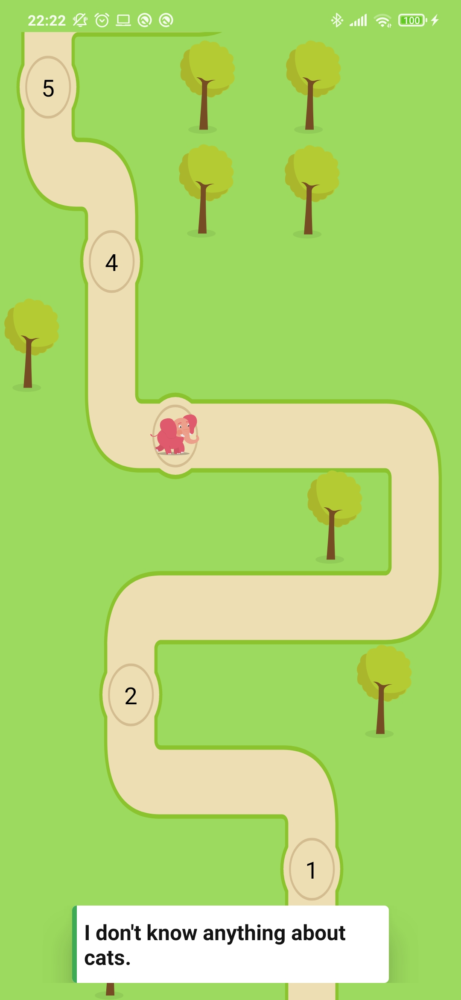

# teste-app-lojong

<h2>Foi densenvolvido usando a arquitetura MVVM, foram utilizado as bibliotecas abaixo:</h2>
<h2>Koin Libary - Usada para implementar a injeção de dependencia;</h2>
<h2>Navigation library - Usada na implementação dos componentes de navegação;</h2>
<h2>Lifecycle library -  Usada para impementar a ViewModel/LiveData;</h2>
<h2>Retrofit library - Usada para implementação da transmissão de dados entre aplicação e webservice;</h2>
<h2>Gson library - Usada para a leitura dos arquivos Json enviados pela API;</h2>
<h2>Lottie libary - Usada para a implementação das animações da view.</h2>

 
 
 